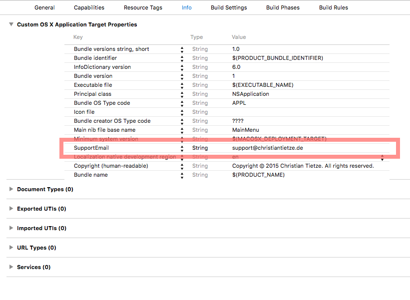
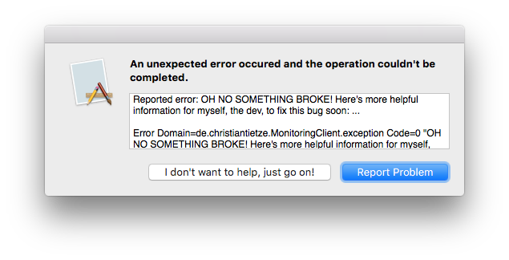

# ErrorHandling

Sooner or later, every program crashes or does something weird. Even when the app can recover, it's best to make the user report problems sooner or later.

Instead of deferring this until later ...

```swift
do {
    try managedObjectContext.save()
} catch let error as NSError {
    fatalError("\(error)") // TODO report crash
}
```

... drop in this micro-framework and have the proper handling in place. You can still worry about the "how" of reporting errors later. But now you will know that errors are handled:


```swift
do {
    try managedObjectContext.save()
} catch let error as NSError {
    applicationError("Saving MOC failed: \(error)")
    // Optionally help the user rescue the data:
    // saveManagedObjectContextChangesToPlist(managedObjectContext)
    return 
}
```

## Set-up

Set up the reporter at the beginning of your app. You can do this during [bootstrapping](http://christiantietze.de/posts/2015/10/bootstrapping-appdelegate/) or simply call this in AppDelegate:

```swift
import ErrorHandling

func bootstrapErrorReporting() {
    ErrorAlert.emailer = TextEmailer()
}
```



The default `TextEmailer` expects your e-mail address in your app's `Info.plist` under the key "**SupportEmail**". Simply add this key with a string value to make it work.


## Usage



The framework includes:

* `ErrorAlert` to display alerts with an error message, informing the user about what happened.
* `TextEmailer` is the default handler of errors. It simply uses the `mailto:` protocol to send a mail with the system's default e-mail program. You can drop in anything you'd like as replacement which conforms to the `ReportEmailer` protocol.

All you have to do is call:

```swift
let error: NSError = ...
ErrorAlert(error: error).displayModal()
```
    
And you're set.

### Reporting (and e-mailing) additional info

The `Report` type allows you to wrap any `Error` with a custom string that should be sent along with the report email.

```swift
let error: Error = ...
let logs = previousLogMessages.joined(separator: "\n")
let report = Report(error: error, additionalInfo: logs)
ErrorAlert(report: report).displayModal()
```

#### Example: Logging to an array with SwiftyBeaver

If you happen to use [SwiftyBeaver](https://github.com/SwiftyBeaver/SwiftyBeaver) for logging, here's a `InMemoryDestination` that keeps track of the past log messages so you can send them along in your report:

```swift
import SwiftyBeaver

class InMemoryDestination: BaseDestination {

    var maxHistory = 5
    fileprivate(set) var messages: [String] = []

    override func send(_ level: SwiftyBeaver.Level, msg: String, thread: String, file: String, function: String, line: Int) -> String? {

        let formattedString = super.send(level, msg: msg, thread: thread, file: file, function: function, line: line) ?? "\(msg) (formatting error!)"

        messages = Array(messages
            .appending(formattedString)
            .suffix(maxHistory))

        return formattedString
    }
}
```


## Convenience methods

Because doing this sucks for unexpected errors, I add something to my projects so I can simply do this:

```
let error: NSError = ...
fatalApplicationError("Start-up failed: \(error)")
```

Or this, to handle cases when I'm stupid:

```swift
programmerError("Unhandled and unexpected exception!!11 \(error)")
```
    
Or this, when something that may regularly go wrong goes wrong but isn't handled properly, yet:

```swift
// Think of it like a feature request! :)
applicationError("File not found: \(error)")
```

Here's some code to achieve just that, as a bonus:

```swift
import Foundation

let errorHandler = ErrorHandler() // This is just for demonstration, of course

@noreturn func fatalApplicationError(message: String, function: String = __FUNCTION__, file: String = __FILE__, line: Int = __LINE__) {

    applicationError(message, function: function, file: file, line: line)
    fatalError(message)
}

func applicationError(message: String, function: String = __FUNCTION__, file: String = __FILE__, line: Int = __LINE__) {

    let error = ErrorHandler.errorWithMessage(message, function: function, file: file, line: line)
    errorHandler.handle(error)
}

func programmerError(message: String, function: String = __FUNCTION__, file: String = __FILE__, line: Int = __LINE__) {

    let error = ErrorHandler.errorWithMessage("Program fault:\n \(message)", function: function, file: file, line: line)
    errorHandler.handle(error)
}

public class ErrorHandler {

    static let exceptionDomain = "de.christiantietze.MyNextApp.exception"
    static var functionKey: String { return "\(exceptionDomain).function" }
    static var fileKey: String { return "\(exceptionDomain).file" }
    static var lineKey: String { return "\(exceptionDomain).line" }

    public init() { }
}

extension ErrorHandler {

    public func handle(error: NSError?) {
    
        if let error = error {
            logError(error)
            reportError(error)
        }
    }
    
    private func logError(error: NSError) {
        
        NSLog("Error: \(error)")
    }
    
    private func reportError(error: NSError) {

        ErrorAlert(error: error).displayModal()
    }

    public static func errorWithMessage(message: String? = nil, function: String = __FUNCTION__, file: String = __FILE__, line: Int = __LINE__) -> NSError {
    
        var userInfo: [String: AnyObject] = [
            functionKey: function,
            fileKey: file,
            lineKey: line,
        ]
    
        if let message = message {
            userInfo[NSLocalizedDescriptionKey] = message
        }
    
        return NSError(domain: exceptionDomain, code: 0, userInfo: userInfo)
    }
}
```

## License

Copyright (c) 2015 Christian Tietze. Distributed under the MIT License.

See LICENSE file for details.
